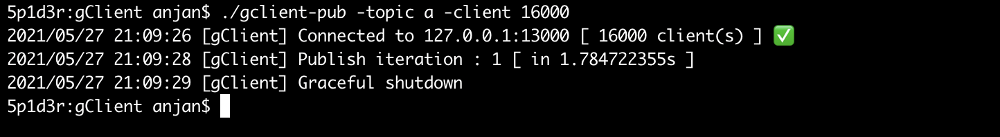

# gClient
Generic Pub/Sub client for 0hub - it's a simulator 🤖

**🔥 16k concurrent connection on consumer grade machine -- with `pub0sub` 🚀**



---

**🔥 With Docker's virtual networking, I recently tested `0hub` with 100k+ concurrent TCP connections🚀**


>  **8192** publishers publishing every 1s on single topic which has **98304** concurrently active subscribers :: **106_496 active TCP connections**

**100K Testing Hardware :** Acceptable resource utilisation on consumer grade machine with i3 (Gen-V); ~12GB RAM; 4 CPUs; HDD ( no disk ops though ) running GNU/Linux based OS


---

## Motivation

Recently I published one fast, light-weight pub/sub system `pub0sub` --- powered by async I/O. I'm interested in collecting some statistics of its performance in real-world, so I'm writing these simulators & visualisation tool.

I plan to collect data over a timespan & visualise the result to gain deeper insight into performance from end-user's perspective.

You can also use it for `"how to use pub0sub ?"`

## Prerequisite

This simulation depends on `0hub` - a pub/sub server system built using `pub0sub` library. We need to set it up first.

> You might want to check [`0hub`](https://github.com/itzmeanjan/pub0sub#hub)

First clone `pub0sub` into your machine

```bash
cd
git clone https://github.com/itzmeanjan/pub0sub.git
```

Now build & run `0hub`

```bash
cd pub0sub
make hub # with default config
```

But you may want to run `0hub` with different config

```bash
# you're in `pub0sub`

make build_hub
./0hub -help # do check it
```

And probably run `0hub` with

```bash
./0hub -addr 127.0.0.1 -port 13000 -capacity 8192
```

**The server is up & running now.**

Using this simulator you're well capable of running lots of publishers/ subscribers on same machine **( or differente machines, talking over LAN )** --- each of them will connect to `0hub` using its own socket connection & use same through out its lifetime.

You'll require to increase max open file descriptor count **( system wide & per process )**, or you'll see `too many open files`

> **Disclaimer :** I only ran this simulation on MacOS & GNU/Linux.

---

**Dockerised 0Hub**

Build hub

```bash
# git clone https://github.com/itzmeanjan/pub0sub.git
# cd pub0sub
# -- continuing after this --

docker build -t 0hub . # assuming docker daemon is running

docker images # image `0hub` must be listed
```

Run hub

```bash
docker run --name hub -d 0hub # not available on 127.0.0.1:*

docker ps # container `hub` must be listed
```

Stop and remove hub

```bash
docker stop hub
docker rm hub # removes container
docker rmi -f 0hub # removes image
```

## Result

Here's result of running this simulation on MacOS x86_64 + 8GB RAM + 8 cores, where 

```
subscriber count = 32
subscriber count = 64
topic = 4

Each publisher publishes each message on each topic
Each subscriber subscribes to each of 4 topics
```

Most messages are queued for publishing in `< 5ms`.


Each queued message is eventually processed by `0hub` - sending it to destination in async fashion.


## Usage

There're 3 components

- Simulator
    - [Publisher](#publisher)
    - [Subscriber](#subscriber)
- [Visualiser](#visualiser)

We'll go through each of them

### Publisher

`gclient-pub` -- a binary read for use

```bash
make build_pub
```

Check help **( definitely )**

```bash
./gclient-pub -help
```

May be run with/ anyhow you please

```bash
./gclient-pub -addr 127.0.0.1 -port 13000 -topic a -topic b -topic c -repeat 0 -client 64 -delay 500ms
```

Log generation is by-default enabled, which generates some new files in **CWD**. If you see **N**-many new log files, it's due to you've set `client` cli option to **N**.

```bash
find . -name 'log_pub_*.csv' # you may try
```

File content might look like

publisher-sent-at-timestamp `( t1 )` | publisher-completed-queueing-at-timestamp `( t2 )` | topic-name
--- | --- | ---
1622035122511 | 1622035122512 | na
1622035123013 | 1622035123013 | na
1622035123514 | 1622035123514 | na
1622035124017 | 1622035124017 | na

> You can ignore `topic-name` column.

These timestamps will satisfy happens before relation

```
t2 >= t1
```

File content to be consumed by visualiser script. See [below](#visualiser).

---

You can disable log generation

```bash
./gclient-pub -topic a -repeat 0 -out false # enabled by default
```

---

**Dockerised Publisher**

Assuming you've docker daemon up & running

```bash
make docker_pub
docker images # image `pub` must be listed
```

Run publisher

```bash
make run_pub
docker ps # container `pub` must be listed
```

Stop publisher

```bash
docker stop pub
```

Remove publisher container

```bash
docker rm pub
```

Remove publisher image

```bash
docker rmi -f pub
```

Read container log

```bash
docker logs pub # add `-f` for following
```

---

### Subscriber

Another binary ready to use -- `gclient-sub`

```bash
make build_sub
```

Check help **( definitely )**

```bash
./gclient-sub -help
```

You might want to run it with


```bash
./gclient-sub -addr 127.0.0.1 -port 13000 -topic a -topic b -topic c -client 64
```

When log generation is enabled **( default )** you'll see some new log files created in **CWD**. There'll will be **N**-many log files generated, where **N = concurrent subscriber count**

```bash
find . -name 'log_sub_*.csv' # you may try
```

They're nothing but append only logs in CSV format, recording

publisher-sent-at-timestamp `( t1 )` | receiver-received-at-timestamp `( t2 )` | topic-name
--- | --- | ---
1622019788183 | 1622019788194 | a
1622019788187 | 1622019788195 | b
1622019788190 | 1622019788199 | c
1622019788192 | 1622019788199 | a

So definitely

```
t2 > t1 # satisfying happens before relation
```

These files to be consumed by visualiser for generating plots demostrating system performance i.e. **how long does it generally take for a message to reach destination from when it was sent ?**

---

You can disable log generation

```bash
./gclient-sub -topic a -out false # enabled by default
```

---

**Dockerised Subscriber**

Assuming you've docker daemon up & running

```bash
make docker_sub
docker images # image `sub` must be listed
```

Run subscriber

```bash
make run_sub
docker ps # container `sub` must be listed
```

Stop subscriber

```bash
docker stop sub
```

Remove subscriber container

```bash
docker rm sub
```

Remove subscriber image

```bash
docker rmi -f sub
```

Read container log

```bash
docker logs sub # add `-f` for following
```

---

### Visualiser

Running above simulation collects performance log for

- Publisher(s) : **Time taken to publish each message**
- Subscriber(s) : **Message reception delay**

---

**How ?** 

Each message published carries millisecond precision unix timestamp serialised in **8 bytes**, which is when message was actually sent from publisher process.

Using this subscriber can deduce how long did it take for a message to arrive to destination from when it was actually prepared on publisher process.

This is what's logged by subscriber [simulator](#subscriber).

On otherside publisher process logs how long did it take for a message to be queued for publishing. This donotes queueing message doesn't really guarantee it's already delivered, rather it says it's queued for delivery.

**It's async** ⭐️.

> All timestamp in milliseconds.

---

Assuming you've already run simulator, you must have logs generated

```bash
find . -name 'log_*.csv'
```

Now you can stop simualtor & start visualiser tool

```bash
cd visualiser
python3 -m venv venv # for first time
source venv/bin/activate

pip install -r requirements.txt # install dependencies

python main.py -h # do check it
python main.py ./.. 12

deactivate
```

If everything goes well, it'll generate two bar charts depicting performance in terms of system **delay in reception/ latency in publishing** in CWD.


```bash
find . -name '*.png' # file names are self-explanatory
```

Yes, that's it.

---

**Note**

Using visualisation tool, I also found out all messages delivered in ordered manner.

Each message carries one unique id, which is monotonically increasing

```
<8-byte-msg-id> + <8-byte-generation-timestamp>
```

When received, deserialisation performed on message extracts out both fields

- `msg-id` : Helps in checking orderliness/ finding if any message missing
- `generation-timestamp` : Unix millisecond precision timestamp used for checking end-to-end message reception delay i.e. _from message sent from producer process to received in consumer process_

These are appended in log file, which will be inspected by visualiser tool & that's when it checks whether each message received in order or not.

> If interested check `accumulate_data(...)` [here](./visualiser/main.py)

---
